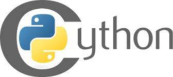

# NlpToolkit

## OverView of Resources

Turkish Natural Language Resources in NlpToolkit

1. Open, Extendible, and Fast Morphological Analyzer Dilbaz.
    +  Over 60.000 root words.
    +  FST and rule engine.
    +  The only morphological analyzer backed by WordNet.
2. Turkish WordNet: KeNet.
    +  80.000 synset.
    +  125.000 semantic relations including 25.000 interlingual relations.
3. SentiNet: HisNet. 
    +  Parallel with KeNet.
    +  80.000 senti-synset.
4. Turkish PropBank: TRopBank.
    +  18.000 verb argument relationship.
    +  Parallel with KeNet.
5. Turkish TreeBank.
    +  74.000 trees (27.000 syntactic 47.000 dependency trees).
    +  Syntactically and semantically annotated
        +  Morphological Analysis
        +  Semantic Roles
        +  Word Senses
        +  Dependency Analysis

## Overview of Library

36 NLP code libraries 

### Word Level Analysis

1. Morphological Analysis Dilbaz v1.0.35 
2. Morphological Disambiguation v1.0.18 
3. Turkish Dictionary v1.0.21 
4. Turkish WordNet KeNet v1.0.42 
5. Turkish SentiNet HisNet v1.0.6 
6. English PosTagger v1.0.2 
7. Turkish SpellChecker v1.0.23 
8. Turkish Deasciifier v1.0.21 

### Sentence Level Analysis

1. Turkish PropBank TRopBank v1.0.11 
2. Dependency Parser v1.0.14 
3. Syntactic Parser v1.0.0 
4. ParseTree v1.0.4 
5. AnnotatedSentence v1.0.27 
6. AnnotatedTree v1.0.16 
7. Corpus v1.0.2 
8. NER Corpus Processing v1.0.3 
9. Turkish FrameNet v1.0.6 
10. Phrase to Dependency, Dependency to Phrase Structure Converter v1.0.0 

### Preliminaries

1. DataStructure v1.0.4 
2. Math v1.0.4 
3. Utils v1.0.3 

### Basic Algorithms

1. Hmm v1.0.1 
2. NGram v1.0.17 
3. WordToVec v1.0.2 

### GUI

1. DataCollector v1.0.14 

### Machine Learning

1. Sampling v1.0.1 
2. Classification v1.0.5 
3. DataGenerator v1.0.6 
4. Clustering v1.0.0 

### High Level Analysis

1. Semantic Role Labeling v1.0.1 
2. Named Entity Recognition v1.0.2 
3. Word Sense Disambiguation v1.0.2 
4. Sentiment Analysis v1.0.1 
5. Shallow Parsing v1.0.1 
6. Dependency Parsing v.1.0.1  
7. Machine Translation v1.0.2  

Best Fit for Natural Language Processing Teaching (NLP, Advanced NLP, Information Retrieval). 

## Contributors

1. Linguistic Annotators
    +  Undergraduate students from Işık University
    +  Linguistics students from Boğaziçi University (Undergraduate, Graduate)
    +  Starlang
2. Computer Engineers
    +  Işık University M.S. Students
    +  Işık University Ph.D. Students
